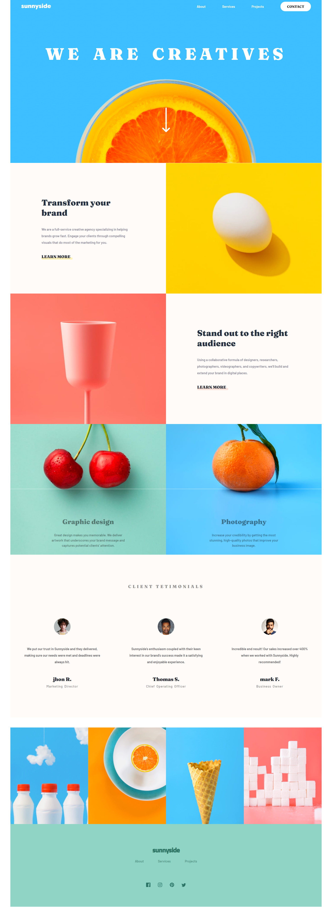

# Frontend Mentor - Sunnyside agency landing page solution

This is a solution to the [Sunnyside agency landing page challenge on Frontend Mentor](https://www.frontendmentor.io/challenges/sunnyside-agency-landing-page-7yVs3B6ef). Frontend Mentor challenges help you improve your coding skills by building realistic projects.

## Table of contents

-   [Overview](#overview)
    -   [The challenge](#the-challenge)
    -   [Screenshot](#screenshot)
    -   [Links](#links)
-   [My process](#my-process)
    -   [Built with](#built-with)
    -   [Useful resources](#useful-resources)
-   [Author](#author)

**Note: Delete this note and update the table of contents based on what sections you keep.**

## Overview

I mainly started this project for the goal of refreshing my knowledge of vanilla JS, since one can get too used to the latest technologies such as react, firebase, mongoDB... etc.
It is a common routine for me to start a new little project which i can take it easy with, and i really suggest it for my fellow developers.

### The challenge

Users should be able to:

-   View the optimal layout for the site depending on their device's screen size
-   See hover states for all interactive elements on the page

### Screenshot

### Links

-   Solution URL: [solution URL here](https://github.com/ReyZis/sunnyside)
-   Live Site URL: [live site URL here](https://your-live-site-url.com)

## My process

as every vanilla html, css, js project go, i start with building the foundamental structure of a section in html, then i move to styling it using css, then when finishing with the final look that I am satified with, i try to make responsive with every pc screen.
then i reapeat this process with every section in the page.
after I am finished, I started working on the mobile version, which took me a couple of adjestment using @media.

Why didn't I work with "Mobile-first workflow"?. just because :p.

### Built with

-   Semantic HTML5 markup
-   CSS custom properties
-   Flexbox
-   CSS Grid

### Useful resources

-   [color picker](https://pinetools.com/image-color-picker) - I used this to pick the right color from the design image provided in the starter code

## Author

-   Frontend Mentor - [Mohamed Rami Megherbi](https://www.linkedin.com/in/mohamed-rami-megherbi-1a18b91b2/)
-   Twitter - [Mohamed Rami Megherbi](https://github.com/ReyZis)
